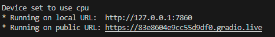
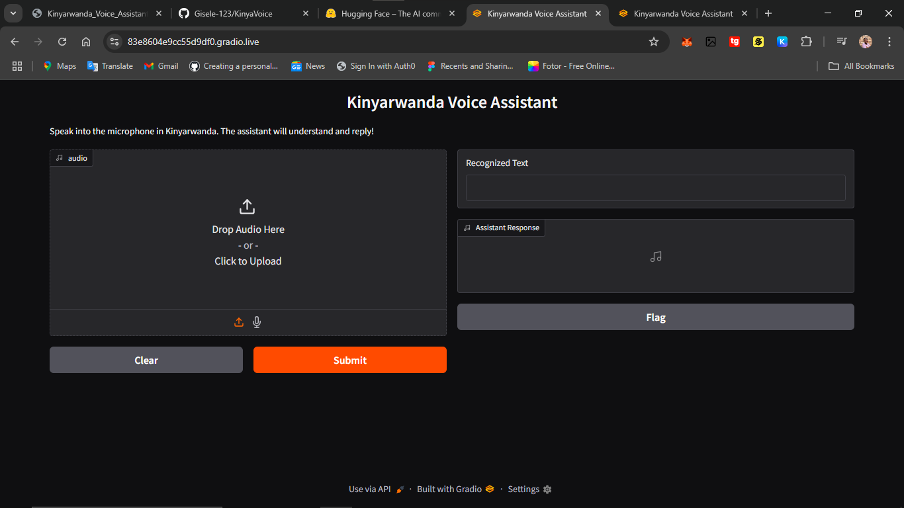

# Mini Kinyarwanda Voice Assistant 🇷🇼🎙️

> A simple intelligent voice assistant prototype for Kinyarwanda, designed for the Intelligent Robotics course assignment.

## Download the voice samples here: 
https://commonvoice.mozilla.org/rw/datasets

## Shareablle link og gradio which expires in one week


## Interface



## 📚 Project Overview

This project simulates a basic humanoid robot's ability to:

- **Listen** to human speech in Kinyarwanda (ASR),
- **Understand** the meaning (NLP),
- **Respond** by speaking back in Kinyarwanda (TTS).

We achieve this by using:
- **KinyaWhisper** ASR model (via Hugging Face),
- A basic **NLP matching** technique,
- **gTTS** (Google Text-to-Speech) for voice response.

---

## 📦 Project Structure

```bash
voice_assistant/
│
├── sample_audio/     
│
├── asr_module.py     
│
├── main.py            
│
├── requirements.txt   
│
└── README.md   


